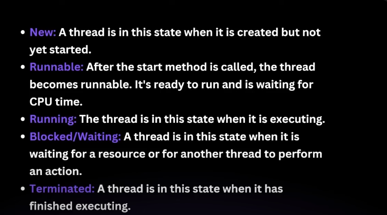
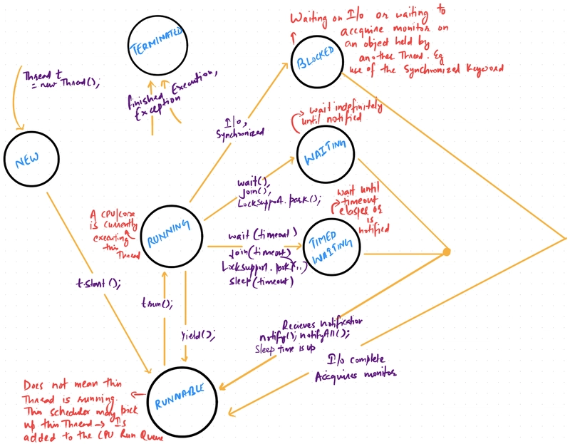

# Thread in Java


Java creates main thread when running the main function:
```java
    public static void main(String[] args) {
        System.out.println("Hello world");
        System.out.println(Thread.currentThread().getName()); // output: main
    }
```


# 1. Method-1:

```java

public class Test {
    public static void main(String[] args) {
        System.out.println(Thread.currentThread().getName());
        World world = new World();
        world.start();

        for (int i = 0; i < 10000; i++) {
            System.out.println(Thread.currentThread().getName()); // prints main
        }
    }
}
```
`World.java`
```java
public class World extends Thread {
    @Override
    public void run() {
        for (int i = 0; i < 10000; i++) {
             System.out.println(Thread.currentThread().getName()); // prints thread-0
        }
    }
}
```
  
Output:  
main  
thread-0  
thread-0  
main  
thread-0  
.
.
.
- it will print main and thread-0 in random order, since both threads are being executed parallely.
- run method is overriden to define the code that constitutes the new thread.
- start method is called to initiate the new thread.

# 2. Method-2: Using Runnable interface

```java

public class Test {
    public static void main(String[] args) {
        World2 world = new World2();
        Thread t1 = new Thread(world2);
        t1.start();

        for (int i = 0; i < 10000; i++) {
            System.out.println(Thread.currentThread().getName()); // prints main
        }
    }
}
```
`World2.java`
```java
public class World2 implements Runnable {
    @Override
    public void run() {
        for (int i = 0; i < 10000; i++) {
             System.out.println(Thread.currentThread().getName()); // prints Thread-0
        }
    }
}
```
  
Output: same as above

# 3. Thread Lifecycle:




### You can use any Thread class or Runnable interface but in some cases we might have already extend some other class then in that case we will be forced to use Runnable interface cause java does not allow multiple inheritance. 

  

In Java, a thread can exist in one of the following **six states**, defined in the `java.lang.Thread.State` enum:

1. **NEW**

   * The thread is created but hasn’t started yet.
   * Example: `Thread t = new Thread();`

2. **RUNNABLE**

   * The thread has been started using `start()` and is ready to run.
   * It might be actually running or waiting to be picked by the scheduler.
   * **Important**: This state includes both threads that are actively **running** and those that are ready but not yet picked by the CPU(**runnable**).

3. **BLOCKED**

   * The thread is waiting to acquire a lock (monitor) on an object.
   * For example, if another thread is already holding the lock.

4. **WAITING**

   * The thread is waiting indefinitely for another thread to perform a particular action (like `join()` or `wait()` without a timeout).
   * It will stay here until explicitly notified.

5. **TIMED\_WAITING**

   * Similar to `WAITING`, but with a timeout.
   * For example, when using `sleep(milliseconds)`, `join(milliseconds)`, or `wait(milliseconds)`.

6. **TERMINATED**

   * The thread has completed execution or has been stopped due to an exception.


### **Runnable vs Running in Java (Interview POV)**

**Runnable State**:

* When a thread is in the `RUNNABLE` state, it means:

  * It is **ready to run** and has been **started** using `.start()`.
  * It is waiting for the **CPU to schedule** it.
  * **Important**: This state includes both threads that are **actively running** and those that are **ready but not yet picked** by the CPU.

**Running (Not an official state)**:

* Java doesn’t have a separate `RUNNING` state in the `Thread.State` enum.
* But in practice, **"running"** refers to the **subset of Runnable threads that are actually executing** instructions at that moment.
* The thread scheduler (part of the JVM/OS) decides which Runnable thread becomes "running".


# 4. interrupt method

when we call interrupt method on a thread object then the thread object checks for interrupts like sleep or join  
If it found any such interrupt then it immediately stops there.  

---  

# 5. **What is `yield()`?**

**Definition**:
`Thread.yield()` is a **static method** that suggests to the thread scheduler:
🗣️ *"I’m okay giving up the CPU now if someone else wants to run."*

* It **pauses the current thread** temporarily and gives a chance for **other threads of the same priority** to run.
* It does **not guarantee** anything — the same thread might be scheduled again immediately.
* It’s mainly used for **fine-tuning thread behavior** or reducing CPU hogging in tight loops.

---

### 🔍 Example to tie it all together:

```java
Thread t = new Thread(() -> {
    while (true) {
        System.out.println("Running...");
        Thread.yield(); // Voluntarily lets go of the CPU
    }
});
t.start();
```

Here:

* Once `start()` is called, the thread goes to the **Runnable** state.
* When the CPU picks it, it’s **running**.
* When it calls `yield()`, it goes back to **Runnable**, waiting to be picked again.

---

You can say:

> “In Java, 'Runnable' is an official thread state, but 'running' is more of a conceptual state where the thread is actively executing. And `yield()` is a polite way for a thread to let others run, though it’s only a hint to the scheduler — not a command.”
